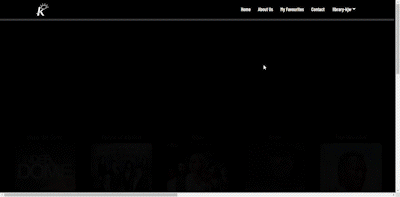

  

# Series Mix App

>Este app fue creado para los amantes de series, busca entre las series mas famosas segun el genero que quieres, sepa mas de tus shows favoritos y agrega las series que te gustan a tus favoritos

 <a href="https://seriesmix-krugerstar.netlify.app/" target="_blank">Check Live app</a>

# 🎥 Project Details

    <h3>A todos aquellos fantaicos de las series y shows internacionales este app es para ustedes, en este app podras hacer lo siguiente :
    </h3>

- Buscar entre las series mas famosas seguna los generos nombres o paiess de produccion
- Saber mas informacion sobre la serie y el rating que obtuvo 
- Ir directamente al sitio oficial de la serie para comprarla o verla si gustas
- Crear una lista de series favoritos

## Built with

- JavaScript
- React
- Html+CSS 
- Netlify

## Live Demo

<a href="https://seriesmix-krugerstar.netlify.app/">Live Demo</a>

## 🏁 Run it on your device

Para poder correr este projecto en tu equipo debe instalar lo siguiente :
 
 - <a href="https://git-scm.com/downloads">Git</a>
 - <a href="https://nodejs.org/en/download/">Node.js</a>

 ## 💿 Instalacion
Para instalar el proyecto sigue los siguientes pasos :
    
- Clonar el repositorio del proyecto corriendo este command:
         `https://github.com/KenanAljaber/krugerStar-Cinema`
 - instalar las librerias o dependencias:
     `cd <el nombre del archivo que contiene el proyect>`
     `npm install`
- Correr el servidor
     `npm start`

## 😬 Como funciona
    Para Crear una cuenta, en la pagina principal puede presionar Sign up y crear una cuenta
    

    Para ingresar a una cuenta
 

 

    Para agregar a favoritos

## Author

👤 **Kenan Aljaber**

- GitHub: [Kenan Aljaber](https://github.com/KenanAljaber)
- LinkedIn: [Kenan Aljaber](https://www.linkedin.com/in/kenan-aljaber-a232aa187/)

👤 **Ariel Piguave**
- GitHub: [Ariel Piguave](https://github.com/Piguave)
- LinkedIn: [Ariel Piguave](https://ec.linkedin.com/in/angel-ariel-piguave-bermello-032bab240?trk=public_profile_samename-profile&original_referer=https%3A%2F%2Fec.linkedin.com%2Fin%2Fangel-ariel-piguave-449a8190)
## 🤝 Contributing

- [Juan Sotomayor](https://github.com/Juanse7793) - Tutor Kruger star

 ## Show your support

Give a ⭐ if you like this project!

 

